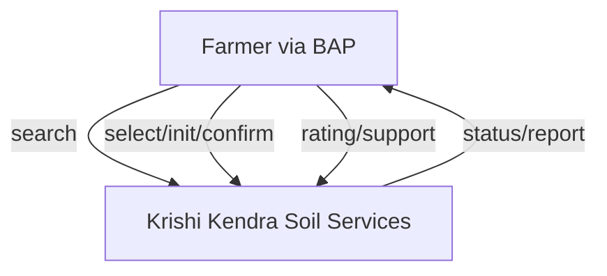
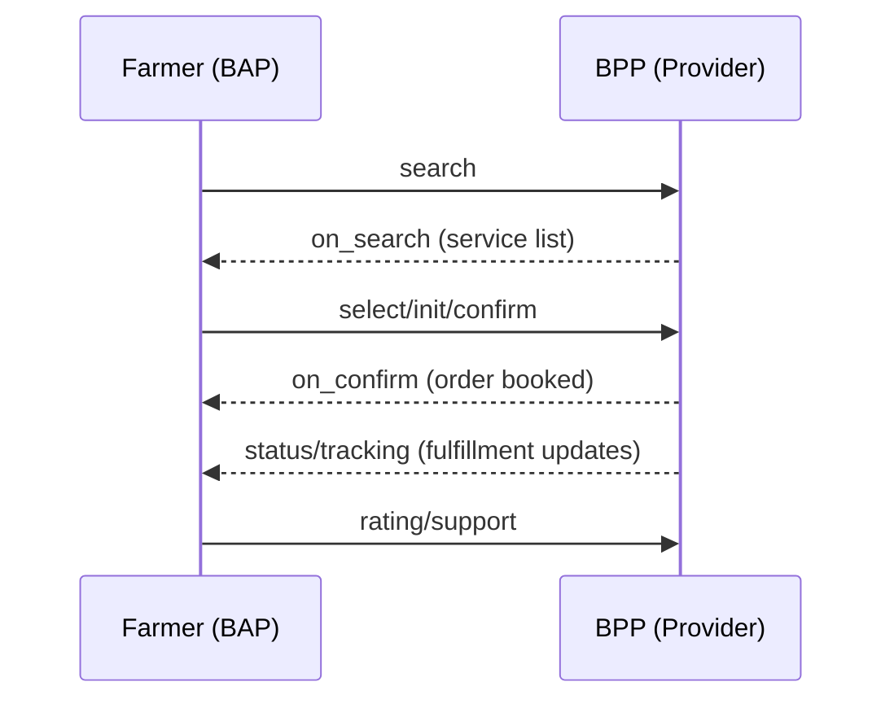
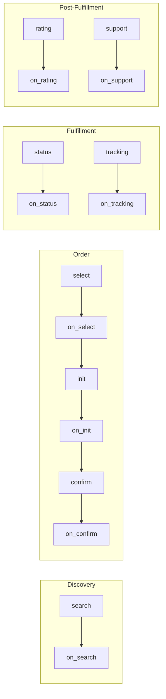
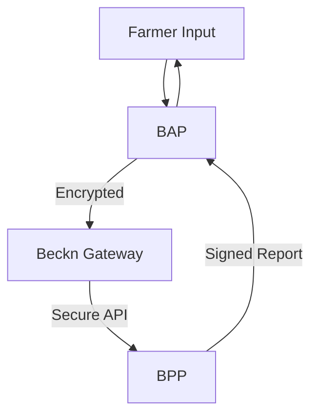

# Krishi Soil Testing – Beckn Protocol Agri Use Case Implementation Guide

---

## Overview

This repository provides an implementation blueprint for integrating agricultural service platforms (BAP/BPP) with the Unified Krishi Interface (UKI) open network, powered by the Beckn Protocol. The use case demonstrated here is **Soil Testing**, enabling seamless discovery, booking, and fulfillment of soil testing services for farmers.

Soil testing is a critical agricultural service that helps farmers optimize crop yields, reduce fertilizer waste, and practice sustainable farming. In the Indian agricultural ecosystem, timely and accurate soil analysis can significantly impact productivity and farmer income. The UKI network aims to democratize access to quality soil testing services across rural and urban farming communities.

---

## Table of Contents

- [1. Introduction](#1-introduction)

- [2. Key Entities & Roles](#2-key-entities--roles)

- [3. Network Roles: BAP & BPP](#3-network-roles-bap--bpp)

- [4. Soil Testing Journey (DOFP)](#4-soil-testing-journey-dofp)

- [5. API Sequence & Payloads](#5-api-sequence--payloads)

- [6. Workflows](#6-workflows)

- [7. Taxonomy & Tags](#7-taxonomy--tags)

- [8. Assumptions & Challenges](#8-assumptions--challenges)

- [9. Developer Notes](#9-developer-notes)

- [10. Implementation Roadmap](#10-implementation-roadmap)

- [11. Compliance Requirements](#11-compliance-requirements)

- [12. Frequently Asked Questions](#12-frequently-asked-questions)


---

## 1. Introduction

This guide is for developers aiming to build or onboard Beckn-enabled BAPs/BPPs into the UKI Agri network for the soil testing use case. The Beckn protocol ensures interoperability, decentralization, and real-time communication between service platforms.

### Benefits of Beckn Protocol for Agricultural Services

- **Decentralized Architecture**: Enables diverse soil testing providers to participate without central control
- **Interoperability**: Farmers can access all providers through any compatible app
- **Scalability**: Network can expand to include new providers and services without restructuring
- **Discoverability**: Makes specialized and local testing services visible to farmers in remote areas
- **Standardization**: Consistent service definitions while allowing for provider-specific variations
- **Data Sovereignty**: Farmers maintain control over their farm data

### Target Audience

- Application developers building farmer-facing apps
- Soil testing service providers looking to digitize offerings
- Agricultural extension agencies providing advisory services
- Agri-input companies offering value-added soil analysis

---

## 2. Key Entities & Roles

|Entity|Description|Role|
|---|---|---|
|**Farmer**|Individual or group who requests soil testing services. May have varying levels of digital literacy and different farm sizes from small-holdings to commercial farms.|BAP User|
|**Aggregator**|Digital platform that consolidates multiple service providers. May include farmer producer organizations (FPOs), agri-tech startups, or extension service companies.|BAP/BPP|
|**Service Provider**|Specialized organizations that conduct soil tests, including government Krishi Kendras, private labs, agricultural universities, and mobile testing units.|BPP|
|**Extension Agent**|Field representatives who help farmers with sample collection, digital interactions, and result interpretation. May be government officials or private service agents.|Optional BAP/BPP|
|**Logistics Partner**|Handles transportation of soil samples from farms to testing labs. May be integrated with the BPP or operate as an independent service.|Fulfillment Partner|
|**Advisory Service**|Interprets soil test results and provides actionable recommendations on fertilizer usage and crop planning.|Value-Added Service|

---

## 3. Network Roles: BAP & BPP

### Beckn Application Platform (BAP)

- **User Interface Management**: Provides multilingual, intuitive interfaces for farmers with varying digital literacy
- **Service Discovery**: Queries the network for appropriate soil testing services based on location, crop type, and testing needs
- **Order Management**: Facilitates service selection, booking, and payment processing
- **Fulfillment Tracking**: Updates farmers on sample collection, testing progress, and report availability
- **Feedback & Support**: Captures service ratings and handles issue escalation
- **Data Management**: Securely stores farmer profiles, farm details, and test history
- **Recommendation Engine**: Optional component to suggest appropriate tests based on crop patterns and season

### Beckn Provider Platform (BPP)

- **Service Catalog Management**: Maintains updated list of available tests, pricing, and service level agreements
- **Availability Management**: Publishes real-time slots for sample collection and testing capacity
- **Logistics Coordination**: Plans and executes sample collection routes for field agents
- **Testing Operations**: Manages laboratory workflows, quality control, and result verification
- **Report Generation**: Creates standardized yet detailed soil analysis reports
- **Agent Allocation**: Assigns qualified personnel for sample collection and farmer interaction
- **Inventory Management**: Tracks testing reagents, collection kits, and other consumables
- **Compliance Handling**: Ensures adherence to regulatory standards for soil testing methodologies

**Mermaid Diagram: BAP ↔ BPP Communication**



---

## 4. Soil Testing Journey (DOFP)

### 4.1. Discovery

- BAP sends `search` to discover soil testing providers based on farmer's location, testing requirements, and preferred collection method
- BPPs respond with available services including:
  - Test packages (basic, comprehensive, crop-specific)
  - Price structures (per test, package rates, subsidized options)
  - Collection methods (farm pickup, drop-off centers, mobile labs)
  - Available time slots for different collection methods
  - Turnaround time for results
  - Additional services (recommendations, fertilizer planning)
  - Credentials and certifications of testing facilities

### 4.2. Order

- Farmer reviews options and selects a provider based on reputation, pricing, and convenience
- Farmer specifies:
  - Collection type preference (on-farm collection or center drop-off)
  - Specific field/plot for testing (may include multiple locations)
  - Preferred collection date and time
  - Crop planning intentions (to inform recommendation needs)
  - Payment method and any applicable subsidy codes
- BAP sends `select` to check final availability and pricing
- BAP sends `init` to begin the booking process and confirm payment details
- BAP sends `confirm` to finalize the order after farmer approval

### 4.3. Fulfillment

- **For On-farm Collection**:
  - BPP assigns qualified agent for the collection
  - Agent receives farm location, contact details, and sampling instructions
  - Agent arrives at farm, authenticates identity to farmer
  - Agent collects samples according to standardized protocols (depth, number of samples, GPS tagging)
  - Agent provides receipt and tracking information to farmer
  - Samples are transported to testing facility with chain-of-custody tracking

- **For Center Drop-off**:
  - Farmer receives sample collection instructions and containers (if applicable)
  - Farmer collects samples following prescribed method
  - Farmer delivers samples to designated collection center
  - Center verifies sample details and provides receipt with tracking information

- **Testing Process**:
  - Samples undergo preparation procedures (drying, grinding, sieving)
  - Laboratory conducts requested tests using standardized methods
  - Quality control measures are applied to ensure accuracy
  - Results are validated by qualified technicians
  - Report is generated with test values and interpretations

- BPP updates fulfillment status at each stage through `status` and `tracking` APIs

### 4.4. Post-Fulfillment

- BPP provides test report through the BAP interface with:
  - Detailed test results with reference ranges
  - Visual representations of soil health parameters
  - Recommendations for soil amendments and fertilizer application
  - Crop suitability suggestions based on soil profile
  - Historical comparison if previous tests are available
- Farmer can request clarifications or additional interpretation
- Farmer rates service on various quality parameters
- Farmer may escalate issues through formal support channels if needed
- Optional follow-up services may be offered (fertilizer procurement, additional testing)

**Mermaid Diagram: DOFP Flow**



---

## 5. API Sequence & Payloads

### 5.1. API Call Sequence

```text
search → on_search → select → on_select → init → on_init → confirm → on_confirm → status → on_status → tracking → on_tracking → update → on_update → support → on_support → rating → on_rating
```

### 5.2. Detailed API Flow with Business Logic

1. **Search Phase**:
   - BAP constructs search with precise farmer requirements (tests, location, timing)
   - BPP filters available services based on capacity, coverage area, and capabilities
   - Response includes service differentiation factors and trust signals

2. **Selection Phase**:
   - BAP sends specific selection criteria with any special requirements
   - BPP validates availability and calculates accurate pricing including any applicable subsidies
   - Final options are presented with clear terms and conditions

3. **Initialization Phase**:
   - BAP sends complete order details including payment preferences
   - BPP holds the requested slot and prepares fulfillment resources
   - Payment gateway integration occurs if prepayment is required

4. **Confirmation Phase**:
   - BAP finalizes the booking with confirmed details
   - BPP allocates resources (personnel, collection kits, lab capacity)
   - Digital contract is established between farmer and provider

5. **Fulfillment Tracking**:
   - Regular status updates are pushed at key milestones
   - Location tracking for field agents during on-farm collection
   - Real-time updates on lab processing stages

6. **Completion and Feedback**:
   - Secure delivery of digital reports with verification mechanisms
   - Structured feedback collection for service improvement
   - Issue resolution through formal support channels if needed

### 5.3. Sample API Snippets

**Request: `POST /search`**

```json
{
  "context": {
    "domain": "beckn.org/agri-soil_testing",
    "action": "search",
    "bap_id": "farmer-app.uki",
    "transaction_id": "txn-12345",
    "country": "IND",
    "city": "std:080",
    "language": "hi",
    "timestamp": "2023-09-15T08:30:45Z"
  },
  "message": {
    "intent": {
      "service": "soil_testing",
      "location": { 
        "gps": "19.9975,73.7898",
        "radius": {
          "value": 30,
          "unit": "km"
        },
        "address": {
          "name": "Shivaji Farm",
          "locality": "Nashik District",
          "state": "Maharashtra"
        }
      },
      "filters": {
        "required_tests": ["npk", "ph", "oc", "micronutrients"],
        "collection_type": "farm_pickup",
        "preferred_dates": {
          "start": "2023-09-20",
          "end": "2023-09-25"
        },
        "crop_intent": ["wheat", "soybean"],
        "farm_size": {
          "value": 5,
          "unit": "acre"
        },
        "price_range": {
          "min": 0,
          "max": 1000
        }
      }
    }
  }
}
```

**Response: `on_search`**

```json
{
  "context": {
    "domain": "beckn.org/agri-soil_testing",
    "action": "on_search",
    "bpp_id": "krishi-kendra-nashik.uki",
    "bap_id": "farmer-app.uki",
    "transaction_id": "txn-12345",
    "country": "IND",
    "city": "std:080",
    "language": "hi",
    "timestamp": "2023-09-15T08:31:15Z"
  },
  "message": {
    "catalog": {
      "providers": [
        {
          "id": "krishi-kendra-1",
          "name": "Maharashtra State Soil Testing Lab",
          "description": "Government certified soil testing laboratory with comprehensive analysis capabilities",
          "tags": [
            {
              "descriptor": {
                "name": "Provider Type",
                "code": "provider-type"
              },
              "list": [
                {
                  "descriptor": {
                    "name": "Government",
                    "code": "govt"
                  }
                }
              ]
            },
            {
              "descriptor": {
                "name": "Certification",
                "code": "certification"
              },
              "list": [
                {
                  "descriptor": {
                    "name": "ICAR Accredited",
                    "code": "icar"
                  }
                }
              ]
            }
          ],
          "locations": [
            {
              "id": "nashik-lab-1",
              "gps": "19.9946,73.7901",
              "address": "Agricultural Research Center, Nashik, Maharashtra - 422001"
            }
          ],
          "items": [
            {
              "id": "basic-package",
              "name": "Basic Soil Analysis Package",
              "description": "Covers essential NPK, pH, and Organic Carbon testing",
              "price": {
                "currency": "INR",
                "value": "350.00",
                "subsidized_value": "150.00",
                "subsidy_scheme": "PM-KISAN"
              },
              "tags": [
                {
                  "descriptor": {
                    "name": "Parameters",
                    "code": "test-parameters"
                  },
                  "list": [
                    {"name": "Nitrogen (N)"},
                    {"name": "Phosphorus (P)"},
                    {"name": "Potassium (K)"},
                    {"name": "pH Value"},
                    {"name": "Organic Carbon (OC)"}
                  ]
                },
                {
                  "descriptor": {
                    "name": "Turnaround Time",
                    "code": "tat"
                  },
                  "list": [
                    {"name": "7 Days"}
                  ]
                }
              ]
            },
            {
              "id": "comprehensive-package",
              "name": "Comprehensive Soil Analysis",
              "description": "Complete soil health assessment including micronutrients",
              "price": {
                "currency": "INR",
                "value": "850.00",
                "subsidized_value": "400.00",
                "subsidy_scheme": "PM-KISAN"
              },
              "tags": [
                {
                  "descriptor": {
                    "name": "Parameters",
                    "code": "test-parameters"
                  },
                  "list": [
                    {"name": "All Basic Package Tests"},
                    {"name": "Zinc (Zn)"},
                    {"name": "Boron (B)"},
                    {"name": "Manganese (Mn)"},
                    {"name": "Iron (Fe)"},
                    {"name": "Copper (Cu)"},
                    {"name": "Soil Texture"}
                  ]
                },
                {
                  "descriptor": {
                    "name": "Turnaround Time",
                    "code": "tat"
                  },
                  "list": [
                    {"name": "10 Days"}
                  ]
                }
              ]
            }
          ],
          "fulfillments": [
            {
              "id": "farm-pickup-service",
              "type": "farm_pickup",
              "slots": [
                {
                  "id": "slot-1",
                  "date": "2023-09-21",
                  "time": {
                    "start": "09:00:00",
                    "end": "12:00:00"
                  }
                },
                {
                  "id": "slot-2",
                  "date": "2023-09-23",
                  "time": {
                    "start": "14:00:00",
                    "end": "17:00:00"
                  }
                }
              ]
            },
            {
              "id": "center-dropoff-service",
              "type": "centre_dropoff",
              "operational_hours": [
                {
                  "days": "mon,tue,wed,thu,fri",
                  "schedule": {
                    "start": "08:00:00",
                    "end": "17:00:00"
                  }
                },
                {
                  "days": "sat",
                  "schedule": {
                    "start": "08:00:00",
                    "end": "13:00:00"
                  }
                }
              ]
            }
          ],
          "payments": [
            {
              "id": "payment-1",
              "type": "PRE-FULFILLMENT",
              "methods": [
                {
                  "id": "upi",
                  "name": "UPI Payment"
                },
                {
                  "id": "cod",
                  "name": "Cash on Delivery"
                }
              ]
            }
          ]
        }
      ]
    }
  }
}
```

**Confirm Request Example:**

```json
{
  "context": {
    "domain": "beckn.org/agri-soil_testing",
    "action": "confirm",
    "bap_id": "farmer-app.uki",
    "bpp_id": "krishi-kendra-nashik.uki",
    "transaction_id": "txn-12345",
    "country": "IND",
    "timestamp": "2023-09-15T09:15:22Z"
  },
  "message": {
    "order": {
      "provider": {
        "id": "krishi-kendra-1"
      },
      "items": [
        {
          "id": "comprehensive-package",
          "quantity": {
            "count": 1
          }
        }
      ],
      "fulfillment": {
        "type": "farm_pickup",
        "selected_slot": {
          "id": "slot-1",
          "date": "2023-09-21",
          "time": {
            "start": "09:00:00",
            "end": "12:00:00"
          }
        },
        "customer": {
          "person": {
            "name": "Smita Patil",
            "phone": "+919812345678",
            "language": "hi"
          }
        },
        "location": {
          "gps": "19.9975,73.7898",
          "address": {
            "name": "Shivaji Farm",
            "building": "North Field Gate",
            "locality": "Pimpalgaon",
            "city": "Nashik",
            "state": "Maharashtra",
            "country": "India",
            "area_code": "422209"
          },
          "instructions": "Call 10 minutes before arrival. Dog at main gate."
        }
      },
      "billing": {
        "name": "Smita Patil",
        "address": {
          "name": "Residence",
          "building": "Shanti Nivas",
          "locality": "Pimpalgaon Main Road",
          "city": "Nashik",
          "state": "Maharashtra",
          "country": "India",
          "area_code": "422209"
        },
        "phone": "+919812345678",
        "subsidy_claim": {
          "scheme": "PM-KISAN",
          "id": "PMKSN123456789"
        }
      },
      "payment": {
        "method": "cod",
        "amount": {
          "currency": "INR",
          "value": "400.00"
        },
        "status": "NOT-PAID"
      },
      "tags": [
        {
          "descriptor": {
            "name": "Crop Intent",
            "code": "crop-intent"
          },
          "list": [
            {"name": "Wheat"},
            {"name": "Soybean"}
          ]
        },
        {
          "descriptor": {
            "name": "Farm Size",
            "code": "farm-size"
          },
          "list": [
            {"name": "5 acres"}
          ]
        },
        {
          "descriptor": {
            "name": "Special Instructions",
            "code": "special-instructions"
          },
          "list": [
            {"name": "Need recommendations for organic farming practices"}
          ]
        }
      ]
    }
  }
}
```

---

## 6. Workflows

### 6.1 DOFP Layered Flow

**Mermaid Diagram: Layered View**



### 6.2 Discovery Workflow Details

1. **User Intent Capture**:
   - Farmer indicates need for soil testing
   - BAP captures farm location, test requirements, and preferences
   - BAP enriches request with contextual information (crop season, local soil types)

2. **Provider Discovery**:
   - BAP constructs and sends search request to network
   - Gateway routes request to relevant BPPs in geographic vicinity
   - BPPs filter their catalog based on service availability for the location

3. **Service Curation**:
   - BPPs compile available service packages, pricing, and fulfillment options
   - Provider credentials and ratings are included for trust building
   - BAP receives and organizes responses for farmer-friendly presentation

### 6.3 Order Workflow Details

1. **Service Selection**:
   - Farmer reviews options and selects preferred provider/package
   - BAP sends selection to BPP for real-time availability check
   - BPP confirms availability and holds the slot temporarily

2. **Order Initialization**:
   - Farmer provides detailed farm location and contact information
   - Any applicable subsidies or discount codes are applied
   - Payment options are presented with breakdown of costs

3. **Order Confirmation**:
   - Farmer reviews full order details and approves
   - Payment processing occurs if prepayment is selected
   - BPP confirms booking and allocates resources
   - Confirmation details are provided to farmer for reference

### 6.4 Fulfillment Workflow Details

1. **Pre-Collection Preparation**:
   - For farm pickup: Agent assigned and provided with route and contact details
   - For center dropoff: Farmer receives collection instructions and container (if needed)
   - Reminder notifications sent to relevant parties

2. **Sample Collection**:
   - Collection performed according to standardized protocols
   - GPS tagging of sample locations for spatial reference
   - Sample custody transfer documented with receipts

3. **Laboratory Processing**:
   - Sample preparation following standard procedures
   - Testing conducted with calibrated equipment
   - Quality checks performed on results
   - Report generation with interpretations

4. **Status Updates**:
   - Regular notifications at key milestone points
   - Delays or issues communicated proactively
   - Estimated completion time updated based on lab workload

### 6.5 Post-Fulfillment Workflow Details

1. **Report Delivery**:
   - Digital report delivered through BAP interface
   - Secure access controls for farmer data privacy
   - Option to download in multiple formats (PDF, CSV)

2. **Recommendation Integration**:
   - Test results linked to crop-specific recommendations
   - Optional integration with input procurement platforms
   - Historical comparison with previous tests if available

3. **Feedback Collection**:
   - Structured rating on multiple service quality parameters
   - Option for detailed feedback on specific aspects
   - Follow-up for low ratings to address issues

4. **Support Resolution**:
   - Channel for questions about test results
   - Process for disputing results or requesting retests
   - Escalation path for unresolved issues

---

## 7. Taxonomy & Tags

### 7.1 Collection Types
- **`farm_pickup`**: Provider sends qualified personnel to collect soil samples directly from the farm
- **`centre_dropoff`**: Farmer collects samples and delivers to a testing center
- **`mobile_lab`**: On-site testing using portable equipment (limited parameters)
- **`kiosk_collection`**: Self-service collection points in agricultural centers

### 7.2 Test Parameters
- **`npk`**: Macro-nutrients (Nitrogen, Phosphorus, Potassium) essential for basic crop growth
- **`ph`**: Soil acidity/alkalinity determining nutrient availability
- **`oc`**: Organic Carbon indicating soil health and microbial activity
- **`ec`**: Electrical Conductivity measuring salinity levels
- **`micronutrients`**: Secondary nutrients (Zn, Fe, Mn, Cu, B) required in smaller quantities
- **`soil_texture`**: Physical composition (sand, silt, clay percentages)
- **`water_retention`**: Soil's capacity to hold water for plant use
- **`cec`**: Cation Exchange Capacity indicating nutrient holding ability
- **`biological_activity`**: Assessment of beneficial microorganism population

### 7.3 Payment Methods
- **`COD`**: Cash on Delivery for farm pickup or at center dropoff
- **`UPI`**: Digital payments through Unified Payments Interface
- **`Card`**: Credit/Debit card payments
- **`Wallet`**: Digital wallet payments
- **`Bank_Transfer`**: Direct bank transfers
- **`Subsidy_Voucher`**: Government-issued testing subsidies

### 7.4 Order Status Taxonomy
- **`Pending`**: Order received but not yet confirmed
- **`Confirmed`**: Order accepted and scheduled
- **`Agent_Assigned`**: Collection personnel allocated (for farm pickup)
- **`En_Route`**: Agent traveling to collection location
- **`Sample_Collected`**: Soil samples obtained and in transit to lab
- **`Received_At_Lab`**: Samples arrived at testing facility
- **`Testing_In_Progress`**: Laboratory analysis underway
- **`Quality_Check`**: Results undergoing verification
- **`Report_Ready`**: Analysis complete and report available
- **`Delivered`**: Report successfully provided to farmer
- **`Cancelled`**: Order terminated before fulfillment
- **`Disputed`**: Results questioned or retest requested

### 7.5 Rating Metrics
- **`service_quality`**: Overall quality of testing service
- **`provider_behavior`**: Professionalism of collection agent or center staff
- **`timeliness`**: Adherence to scheduled timings
- **`report_clarity`**: Comprehensibility of test results and recommendations
- **`value_for_money`**: Perceived value relative to cost
- **`support`**: Quality of assistance for questions or issues
- **`recommendation_usefulness`**: Practicality of provided crop recommendations

### 7.6 Farm Information Tags
- **`crop_history`**: Previous crops grown in the field
- **`irrigation_type`**: Method of water application
- **`farming_practice`**: Conventional, organic, natural farming, etc.
- **`soil_issues`**: Known problems like waterlogging, erosion, compaction
- **`topography`**: Land slope and elevation characteristics

---

## 8. Assumptions & Challenges

### 8.1 Technical Assumptions

- All BAPs/BPPs adhere to Beckn protocol 1.1+ specifications
- Network infrastructure supports real-time API communications
- Digital identity verification is available for field agents
- GPS accuracy is sufficient in rural areas for precise location tagging
- Network participants implement proper data security measures
- Backend systems can handle seasonal demand fluctuations

### 8.2 Operational Assumptions

- Offline farmer interaction via agents is supported for low digital literacy
- Collection logistics handled by providers or authorized agents
- Standard operating procedures exist for sample collection
- Testing methodologies follow accepted agricultural standards
- Result interpretation guidelines are consistent across providers
- Providers maintain adequate quality control measures

### 8.3 Regulatory Assumptions

- Service providers have necessary certifications for soil testing
- Data sharing complies with relevant privacy regulations
- Subsidy schemes can be digitally integrated with payment systems
- Agricultural departments recognize digital soil health reports
- Testing methodologies meet governmental standards

### 8.4 Implementation Challenges

- **Connectivity Issues**: Intermittent internet in rural areas affecting real-time updates
- **Digital Literacy**: Varying levels of comfort with technology among farmers
- **Last-Mile Logistics**: Reaching remote farms efficiently for sample collection
- **Standardization**: Ensuring consistent testing methodologies across providers
- **Language Barriers**: Supporting multiple regional languages for farmer interfaces
- **Payment Integration**: Handling various payment methods including subsidy vouchers
- **Seasonality**: Managing high demand during pre-sowing periods
- **Data Integrity**: Ensuring accurate sample tagging and result association
- **Result Interpretation**: Providing actionable insights from technical data
- **Trust Building**: Establishing credibility of digital soil health reports

### 8.5 Future Considerations

- Integration with precision agriculture systems for automated recommendations
- IoT-enabled soil sensors for continuous monitoring beyond point-in-time testing
- Machine learning models for predictive soil health assessment
- Blockchain for immutable record of soil quality over time
- Carbon credit monitoring through soil organic matter tracking

**Mermaid Diagram: Data Flow & Security Zones**



---

## 9. Developer Notes

### 9.1 Protocol Implementation Guidelines

- Use Beckn protocol v1.1.0 or higher for all API implementations
- Implement proper error handling with standardized error codes
- All timestamps should follow ISO 8601 format (YYYY-MM-DDTHH:MM:SS+TZ)
- Sign and validate payloads using Beckn signing policies (BLSC)
- Implement retry and idempotency mechanisms for network resilience
- Ensure backward compatibility where required
- Cache appropriate responses to minimize network load
- Implement rate limiting to prevent API abuse

### 9.2 Security Best Practices

- Use TLS 1.3 for all API communications
- Implement proper authentication for all endpoints
- Store sensitive farmer data with appropriate encryption
- Use JWE for secure payload transmission when required
- Implement proper role-based access control
- Regular security audits and penetration testing
- Follow OWASP security guidelines for APIs
- Implement proper logging for security monitoring

### 9.3 Performance Considerations

- Optimize search queries for rapid response
- Implement efficient caching strategies
- Design for horizontal scalability
- Set appropriate timeouts for synchronous operations
- Use asynchronous processing for long-running tasks
- Implement efficient database indexing strategies
- Profile and optimize critical API paths
- Plan for seasonal usage spikes

### 9.4 Localization Support

- Implement multilingual support for all user-facing content
- Use Unicode for text handling
- Support locale-specific date and number formats
- Consider cultural nuances in UI/UX design
- Provide region-specific agricultural terminology

### 9.5 Sample Context Object

```json
{
  "context": {
    "domain": "beckn.org/agri-soil_testing",
    "action": "search",
    "core_version": "1.1.0",
    "bap_id": "your-bap-id",
    "bpp_id": "krishi-kendra-bpp",
    "transaction_id": "txn-abc123",
    "message_id": "msg-xyz789",
    "timestamp": "2025-06-03T12:00:00Z",
    "country": "IND",
    "city": "std:080",
    "ttl": "P1D",
    "bap_uri": "https://yourbap.com/beckn",
    "bpp_uri": "https://krishikendra.org/beckn"
  }
}
```

### 9.6 Sample Order Object

```json
{
  "order": {
    "order_id": "order-7890",
    "provider_id": "krishi-kendra-1",
    "service": "soil_testing",
    "collection_type": "farm_pickup",
    "scheduled_slot": "2025-06-06T09:00",
    "customer_info": {
      "name": "Smita",
      "contact": "+919812345678",
      "language_preference": "Marathi",
      "location": {
        "gps": "19.9975,73.7898",
        "address": "Nashik, Maharashtra",
        "plot_identifiers": {
          "survey_number": "123/4B",
          "khasra_number": "456-7"
        }
      }
    },
    "sample_details": {
      "collection_depth": "15-30cm",
      "sample_count": 5,
      "plot_size": "2.5 acres",
      "previous_crop": "Cotton",
      "planned_crop": "Wheat"
    },
    "test_package": {
      "id": "comprehensive",
      "parameters": ["npk", "ph", "oc", "micronutrients", "texture"],
      "additional_requests": "Please check for sodium content"
    },
    "payment": {
      "type": "COD",
      "amount": 350,
      "subsidized_amount": 150,
      "subsidy_scheme": "PM-KISAN"
    },
    "status": "Confirmed",
    "created_at": "2025-06-01T14:30:45Z",
    "updated_at": "2025-06-01T14:35:12Z"
  }
}
```

### 9.7 Sample Report Object

```json
{
  "report": {
    "report_id": "rpt-12345",
    "order_id": "order-7890",
    "lab_id": "lab-nashik-01",
    "testing_date": "2025-06-10",
    "sampling_location": {
      "gps": "19.9975,73.7898",
      "address": "Nashik, Maharashtra"
    },
    "results": {
      "ph": {
        "value": 6.8,
        "unit": "pH",
        "interpretation": "Slightly acidic",
        "optimal_range": "6.5-7.5",
        "recommendation": "No pH adjustment needed"
      },
      "nitrogen": {
        "value": 280,
        "unit": "kg/ha",
        "interpretation": "Medium",
        "optimal_range": "280-560",
        "recommendation": "Apply 120 kg/ha of nitrogen"
      },
      "phosphorus": {
        "value": 15,
        "unit": "kg/ha",
        "interpretation": "Low",
        "optimal_range": "25-50",
        "recommendation": "Apply 60 kg/ha of phosphorus"
      },
      "potassium": {
        "value": 190,
        "unit": "kg/ha",
        "interpretation": "Medium",
        "optimal_range": "150-250",
        "recommendation": "Apply 40 kg/ha of potassium"
      },
      "organic_carbon": {
        "value": 0.6,
        "unit": "%",
        "interpretation": "Medium",
        "optimal_range": "0.5-0.75",
        "recommendation": "Add organic manure @ 5 tons/ha"
      }
    },
    "summary": {
      "soil_health_index": 7.2,
      "major_deficiencies": ["Phosphorus"],
      "key_recommendations": [
        "Apply balanced NPK fertilizer with higher phosphorus content",
        "Incorporate organic matter to improve soil structure",
        "Consider green manuring in next fallow period"
      ],
      "suitable_crops": ["Wheat", "Gram", "Maize"]
    },
    "certification": {
      "lab_technician": "Dr. Prakash Sharma",
      "certification_id": "IARI-ST-12345",
      "digital_signature": "sig-hash-9876543210"
    }
  }
}
```

## 10. Implementation Roadmap

### 10.1 Phase 1: Core Integration
- Basic search and discovery implementation
- Simple order booking flow
- Fundamental fulfillment tracking
- Basic report delivery

### 10.2 Phase 2: Enhanced Features
- Advanced search filters
- Multiple payment methods
- Detailed status tracking
- Comprehensive reporting
- Basic recommendation engine

### 10.3 Phase 3: Advanced Capabilities
- AI-powered recommendations
- Integration with input supply chains
- Historical data analysis
- Precision agriculture connections
- IoT sensor integration options

## 11. Compliance Requirements

### 11.1 Data Protection
- Farmer consent for data collection and processing
- Secure storage of personal and farm data
- Data minimization principles
- Right to access and delete personal information

### 11.2 Agricultural Standards
- Compliance with ICAR testing methodologies
- Adherence to state agricultural department guidelines
- Proper sample handling procedures
- Calibrated equipment requirements

### 11.3 Subsidy Integration
- Digital verification of subsidy eligibility
- Transparent subsidy application
- Proper documentation for audit trails
- Compliance with government scheme requirements

## 12. Frequently Asked Questions

### 12.1 Technical FAQs
- **Q: How do I handle network timeouts in rural areas?**  
  A: Implement progressive caching and offline capabilities with synchronization when connectivity is restored.

- **Q: How can we ensure sample identity through the testing process?**  
  A: Use unique barcodes/QR codes for each sample with digital chain-of-custody tracking.

### 12.2 Business FAQs
- **Q: How do government subsidies integrate with the payment flow?**  
  A: Subsidy eligibility is verified during the init phase and applied as a discount before confirming the final price.

- **Q: What happens if a farmer disputes test results?**  
  A: The platform provides a formal dispute resolution process including optional retesting procedures.

---

## References
- [Beckn Protocol Documentation](https://becknprotocol.io/)
- [Unified Krishi Interface (UKI)](https://uki.network/)
- [Beckn Protocol GitHub](https://github.com/beckn/beckn-protocol-specs)
- [Indian Council of Agricultural Research (ICAR) Soil Testing Guidelines](https://icar.gov.in/)
- [Digital Agriculture Mission 2021-2025](https://agricoop.gov.in/)
- [PM-KISAN Scheme Portal](https://pmkisan.gov.in/)
- [Soil Health Card Scheme](https://soilhealth.dac.gov.in/)
- [National Informatics Centre (NIC) Digital Services](https://www.nic.in/)