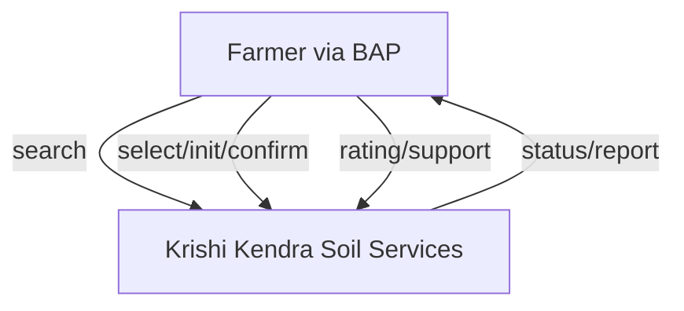
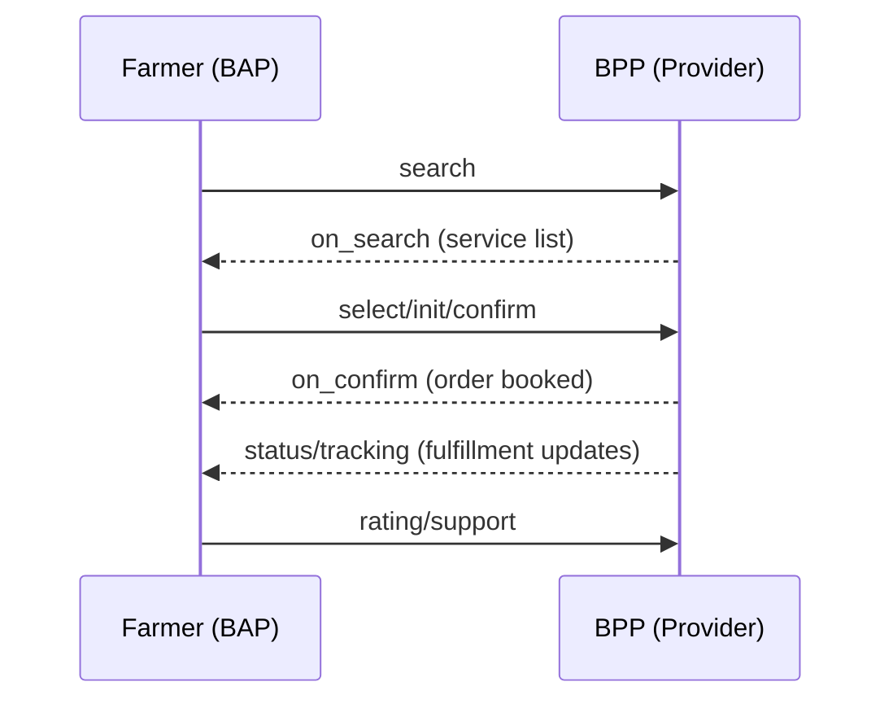
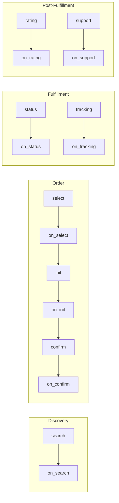
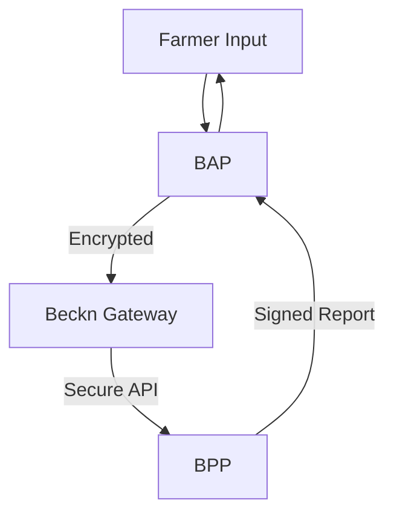

# Krishi Soil Testing – Beckn Protocol Agri Use Case Implementation Guide

---

## Overview

This repository provides an implementation blueprint for integrating agricultural service platforms (BAP/BPP) with the Unified Krishi Interface (UKI) open network, powered by the Beckn Protocol. The use case demonstrated here is **Soil Testing**, enabling seamless discovery, booking, and fulfillment of soil testing services for farmers.

---

## Table of Contents

- [1. Introduction](#1-introduction)
    
- [2. Key Entities & Roles](#2-key-entities--roles)
    
- [3. Network Roles: BAP & BPP](#3-network-roles-bap--bpp)
    
- [4. Soil Testing Journey (DOFP)](#4-soil-testing-journey-dofp)
    
- [5. API Sequence & Payloads](#5-api-sequence--payloads)
    
- [6. Workflows](#6-workflows)
    
- [7. Taxonomy & Tags](#7-taxonomy--tags)
    
- [8. Assumptions & Challenges](#8-assumptions--challenges)
    
- [9. Developer Notes](#9-developer-notes)
    

---

## 1. Introduction

This guide is for developers aiming to build or onboard Beckn-enabled BAPs/BPPs into the UKI Agri network for the soil testing use case. The Beckn protocol ensures interoperability, decentralization, and real-time communication between service platforms.

---

## 2. Key Entities & Roles

|Entity|Description|Role|
|---|---|---|
|**Farmer**|Requests soil testing services|BAP User|
|**Aggregator**|Connects to multiple providers|BAP/BPP|
|**Service Provider**|Offers soil testing services (e.g., Krishi Kendra)|BPP|
|**Extension Agent**|Aids in sampling and communication|Optional BAP/BPP|

---

## 3. Network Roles: BAP & BPP

### Beckn Application Platform (BAP)

- Interfaces with farmers
    
- Performs service discovery, order management, feedback, and support
    

### Beckn Provider Platform (BPP)

- Lists and fulfills soil testing services
    
- Manages availability, logistics, reporting, and agent allocation
    

**Mermaid Diagram: BAP ↔ BPP Communication**



---

## 4. Soil Testing Journey (DOFP)

### 4.1. Discovery

- BAP sends `search` to discover soil testing providers
    
- BPPs respond with available services, slots, cost, etc.
    

### 4.2. Order

- Farmer selects a provider and collection type
    
- BAP sends `select`, `init`, and `confirm` API calls
    

### 4.3. Fulfillment

- On-farm: Agent collects soil from farm
    
- Drop-off: Farmer submits sample at center
    
- BPP updates fulfillment status
    

### 4.4. Post-Fulfillment

- BPP provides test report
    
- Farmer rates service and may escalate issues
    

**Mermaid Diagram: DOFP Flow**



---

## 5. API Sequence & Payloads

### 5.1. API Call Sequence

```text
search → on_search → select → on_select → init → on_init → confirm → on_confirm → status → on_status → tracking → on_tracking → update → on_update → support → on_support → rating → on_rating
```

### 5.2. Sample API Snippets

**Request: `POST /search`**

```json
{
  "context": {
    "domain": "beckn.org/agri-soil_testing",
    "action": "search",
    "bap_id": "farmer-app.uki",
    "transaction_id": "txn-12345",
    "country": "IND",
    "city": "std:080"
  },
  "message": {
    "intent": {
      "service": "soil_testing",
      "location": { "gps": "19.9975,73.7898" },
      "filters": {
        "required_tests": ["npk", "ph", "oc"],
        "collection_type": "farm_pickup"
      }
    }
  }
}
```

**Response: `on_search`**  
(Provider list including cost, tests, policies)

---

## 6. Workflows

### DOFP Layered Flow

**Mermaid Diagram: Layered View**



---

## 7. Taxonomy & Tags

- **Collection Types:** `farm_pickup`, `centre_dropoff`
    
- **Required Tests:** `npk`, `ph`, `oc`, `ec`, `micronutrients`, `soil_texture`
    
- **Payment Methods:** `COD`, `UPI`, `Card`
    
- **Order Status:** `Pending`, `Confirmed`, `Sample collected`, `Testing in progress`, `Report ready`
    
- **Rating Metrics:** `service_quality`, `provider_behavior`, `support`
    

---

## 8. Assumptions & Challenges

**Assumptions**

- All BAPs/BPPs adhere to Beckn protocol 1.1+
    
- Offline farmer interaction via agents is supported
    
- Collection logistics handled by providers or agents
    

**Challenges**

- Ensuring real-time updates for rural logistics
    
- Ensuring multilingual interfaces
    
- Secure handling of soil sample and farmer data
    

**Mermaid Diagram: Data Flow & Security Zones**



---

## 9. Developer Notes

- Use Beckn protocol v1.1.0 or higher
    
- All timestamps should follow ISO 8601 format
    
- Sign and validate payloads using Beckn signing policies
    
- Implement retry and idempotency mechanisms
    
- Ensure backward compatibility where required
    

### Sample Context Object

```json
{
  "context": {
    "domain": "beckn.org/agri-soil_testing",
    "action": "search",
    "core_version": "1.1.0",
    "bap_id": "your-bap-id",
    "bpp_id": "krishi-kendra-bpp",
    "transaction_id": "txn-abc123",
    "message_id": "msg-xyz789",
    "timestamp": "2025-06-03T12:00:00Z",
    "country": "IND",
    "city": "std:080"
  }
}
```

### Sample Order Object

```json
{
  "order": {
    "order_id": "order-7890",
    "provider_id": "krishi-kendra-1",
    "service": "soil_testing",
    "collection_type": "farm_pickup",
    "scheduled_slot": "2025-06-06T09:00",
    "customer_info": {
      "name": "Smita",
      "contact": "+919812345678",
      "location": {
        "gps": "19.9975,73.7898",
        "address": "Nashik, Maharashtra"
      }
    },
    "payment": {
      "type": "COD",
      "amount": 350
    },
    "status": "Confirmed"
  }
}
```

---

## References
- [Beckn Protocol Documentation](https://becknprotocol.io/)
- [Unified Krishi Interface (UKI)](https://uki.network/)
- [Beckn Protocol GitHub](https://github.com/beckn/beckn-protocol-specs)