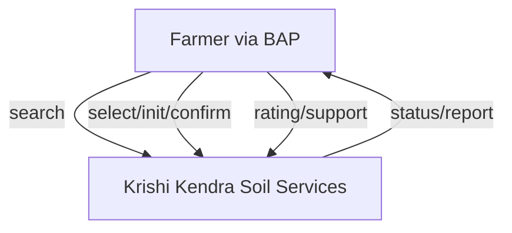
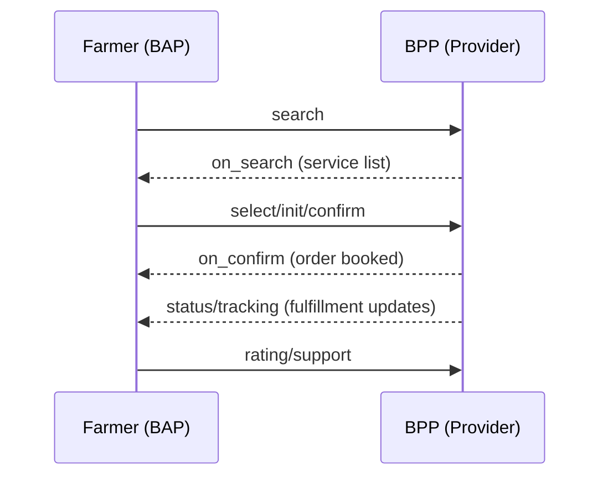
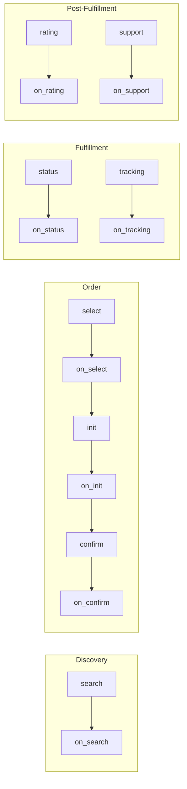
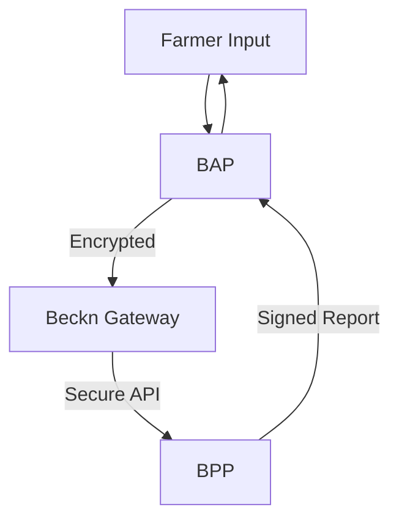

# UKI Soil Testing – Beckn Protocol Agri Use Case Implementation Guide

---

## Overview

This comprehensive guide helps network participants build and integrate applications with the Unified Krishi Interface (UKI) open network using the Beckn Protocol for soil testing services.

Soil testing is fundamental to modern agriculture in India. It empowers farmers to make data-driven decisions that significantly increase crop yields, optimize fertilizer usage, reduce unnecessary costs, and promote environmentally sustainable farming practices. Without proper soil analysis, farmers are essentially farming blindfolded - unable to address specific nutrient deficiencies or soil health issues that directly impact their livelihood.

---

## Table of Contents

- [1. Introduction](#1-introduction)
- [2. BAP-BPP Roles and Entity Mapping](#2-bap-bpp-roles-and-entity-mapping)
- [3. Network Roles: BAP & BPP](#3-network-roles-bap--bpp)
- [4. Soil Testing Journey (DOFP)](#4-soil-testing-journey-dofp)
- [5. API Calls and Schema](#5-api-calls-and-schema)
- [6. Flow Diagrams](#6-flow-diagrams)
- [7. Taxonomy & Tags](#7-taxonomy--tags)
- [8. Assumptions & Challenges](#8-assumptions--challenges)
- [9. Developer Notes](#9-developer-notes)
- [10. Implementation Roadmap](#10-implementation-roadmap)
- [11. Compliance Requirements](#11-compliance-requirements)
- [12. Frequently Asked Questions](#12-frequently-asked-questions)

---

## 1. Introduction

This guide serves developers who want to build or integrate applications into the UKI Agri network specifically for soil testing services. The Beckn protocol creates a standardized way for different agricultural platforms to communicate with each other, making services more accessible to farmers across India.

### Benefits of Beckn Protocol for Agricultural Services

- **Decentralized Architecture**: Allows many different soil testing providers to join the network without any single company controlling everything - from small local labs to large government facilities
- **Interoperability**: Farmers can use any compatible app to access all testing services in the network, eliminating the need to download multiple apps
- **Scalability**: The network can grow to include thousands of providers and new types of services without requiring major system changes
- **Discoverability**: Makes it easy for farmers to find specialized local testing services that they might never have known existed otherwise
- **Standardization**: Creates consistent ways to define and deliver services while still allowing providers to offer their unique specialties
- **Data Sovereignty**: Farmers remain in control of their own farm data, deciding who can access it and how it can be used

### Target Audience

- **App Developers**: Teams building mobile or web applications that farmers will use to request soil testing
- **Soil Testing Providers**: Government labs, private companies, and universities looking to make their services digitally accessible
- **Agricultural Extension Services**: Organizations that help educate and support farmers with technical advice
- **Agri-input Companies**: Fertilizer, seed, and other agricultural input providers who want to offer value-added soil analysis to improve their services

---

## 2. BAP-BPP Roles and Entity Mapping

### Network Participants

#### Entities Involved:
1. **Farmer** - End user who needs soil testing services (digital literacy varies from limited to tech-savvy)
2. **Aggregator** - Organizations bringing together multiple service providers (FPOs, startups, government apps)
3. **Service Provider** - Actual soil testing facilities (government labs, private laboratories, universities, mobile units)
4. **Extension Agent** - Field workers who help farmers use digital platforms and explain results
5. **Logistics Partner** - Services transporting soil samples from farms to laboratories
6. **Advisory Service** - Experts analyzing test results and providing crop recommendations

#### BAP-BPP Role Mapping:

**BAP (Beckn Application Platform) - Farmer Side:**
- **Farmer Mobile App/Portal**: Interface used by farmers to discover and book soil testing services
- **Agricultural Advisory Platform**: Apps that help farmers with farm management
- **Government Extension Services**: Digital platforms used by agricultural extension officers

**BPP (Beckn Provider Platform) - Service Provider Side:**
- **Soil Testing Laboratory Platform**: Digital platform of certified soil testing labs
- **Agricultural Service Aggregator**: Platform aggregating multiple soil testing services
- **Integrated Farm Service Provider**: Companies providing end-to-end agricultural services

### Network Architecture



---

## 3. Network Roles: BAP & BPP

### Beckn Application Platform (BAP)

- **User Interface Management**: Creates farmer-friendly screens in local languages with simple navigation, visual aids, and voice support for those who cannot read
- **Service Discovery**: Finds and displays suitable soil testing services near the farmer based on their specific needs, location, and the crops they grow
- **Order Management**: Helps farmers select services, schedule sample collection, and handle payments with multiple options (cash, digital, subsidies)
- **Fulfillment Tracking**: Provides clear updates on when samples will be collected, testing progress, and when results will be available
- **Feedback & Support**: Allows farmers to rate services and get help if something goes wrong
- **Data Management**: Safely stores information about farms, previous test results, and farmer preferences while ensuring privacy
- **Recommendation Engine**: Suggests the most appropriate tests based on what crops the farmer grows, seasonal factors, and regional soil issues

### Beckn Provider Platform (BPP)

- **Service Catalog Management**: Maintains a comprehensive, up-to-date list of all available soil tests with clear descriptions, benefits, and pricing
- **Availability Management**: Shows when testing services are available in different areas with real-time scheduling
- **Logistics Coordination**: Plans efficient routes for field agents to collect samples from multiple farms in a single trip
- **Testing Operations**: Manages the entire laboratory workflow from sample preparation to analysis using standardized methods
- **Report Generation**: Creates easy-to-understand soil analysis reports with visual elements to help farmers interpret complex data
- **Agent Allocation**: Assigns the right field staff based on location, language needs, and technical expertise
- **Inventory Management**: Tracks and maintains adequate supplies of testing materials, sample containers, and chemicals
- **Compliance Handling**: Ensures all testing follows government standards and scientific protocols for accurate results

---

## 4. Soil Testing Journey (DOFP)

### Use Case Visualization: Ravi's Soil Testing Journey

Ravi, a cotton farmer from Wardha, Maharashtra, notices declining yields and uses a UKI-enabled app to find soil testing services. He searches by location, test type, collection method, and budget. The app shows multiple providers including AgriLab Solutions, SoilCare Labs, and FarmTest Services. Ravi selects SoilCare Labs for comprehensive testing with home pickup, providing his details and farm location. After confirmation, collection agent Rajesh arrives the next day to collect samples following proper protocols. Ravi receives updates throughout the process and eventually gets a detailed digital report with nutrient status, deficiency analysis, fertilizer recommendations, and crop suggestions. He then rates the service and can access advisory support for implementing recommendations.

### 4.1. Discovery

- When a farmer needs soil testing, their app (BAP) sends a `search` request to find available services
- The search includes important details like:
  - The farmer's exact location
  - What kind of soil tests they need
  - How they want samples collected (pickup from farm or drop-off at a center)
- Testing providers (BPPs) respond with complete information:
  - Different testing packages (from basic NPK tests to comprehensive analysis)
  - Clear pricing (including any government subsidies or special rates)
  - Collection options (whether they'll come to the farm or the farmer needs to bring samples)
  - Available dates and times for sample collection
  - How long it will take to get results (turnaround time)
  - Additional services like personalized recommendations
  - Credentials showing they're qualified and certified

### 4.2. Order

- The farmer reviews all available options and chooses a provider based on what matters most to them (price, convenience, reputation, etc.)
- The farmer then provides specific details:
  - Whether they want someone to come collect samples or they'll drop them off
  - Exactly which fields or plots need testing (with locations for multiple areas)
  - When they'd prefer the collection to happen
  - What crops they plan to grow (so recommendations can be tailored)
  - How they want to pay and any subsidy programs they qualify for
- The app follows a three-step process to confirm the order:
  - `select`: Checks final availability and confirms exact pricing
  - `init`: Begins the booking process and sets up payment
  - `confirm`: Finalizes the order after the farmer reviews and approves everything

### 4.3. Fulfillment

- **When the Provider Collects Samples from the Farm**:
  - The testing lab assigns a qualified technician to visit the farm
  - The technician receives detailed information about the farm location and specific needs
  - Upon arrival, the technician shows ID to confirm they're official
  - Samples are collected following scientific protocols (proper depth, multiple samples mixed, GPS-tagged locations)
  - The farmer receives a detailed receipt and way to track their samples
  - Samples are carefully transported to the lab with proper handling

- **When the Farmer Brings Samples to a Collection Center**:
  - The farmer receives clear instructions and proper containers for collecting samples
  - Step-by-step guidance helps them take samples correctly
  - The farmer brings samples to the nearest collection center
  - Staff verify the samples and provide a tracking receipt

- **Inside the Testing Laboratory**:
  - Samples go through preparation (drying, grinding, sieving) to ensure accurate testing
  - Lab technicians conduct the requested tests using standardized scientific methods
  - Quality checks verify the accuracy of results
  - Experts review the results to confirm they make sense
  - A comprehensive report is created with all test values and what they mean

- Throughout this process, the farmer receives updates through their app about where their samples are and what's happening

### 4.4. Post-Fulfillment

- Once testing is complete, the farmer receives a comprehensive report through their app that includes:
  - Clear presentation of all test results with normal ranges clearly marked
  - Visual charts and graphs making it easy to understand soil health
  - Specific recommendations for fertilizers and soil treatments
  - Suggestions for which crops would grow best in their soil
  - Comparison with previous tests if available to show trends
- Farmers can ask questions if anything in the report is unclear
- They can rate the service quality to help other farmers
- If there are problems, they can file a formal complaint
- They may be offered additional services like fertilizer delivery or follow-up testing

**Mermaid Diagram: DOFP Flow**



---

## 5. API Calls and Schema

### 5.1. API Call Sequence

```
search → on_search → select → on_select → init → on_init → confirm → on_confirm → status → on_status → tracking → on_tracking → update → on_update → support → on_support
```

### 5.2. Sample API Payloads

#### Discovery of Soil Testing Services

**Request: `POST /search`**

```json
{
  "context": {
    "domain": "services:uki",
    "action": "search",
    "location": {
      "country": {
        "name": "India",
        "code": "IND"
      },
      "city": {
        "name": "Wardha",
        "code": "std:07152"
      }
    },
    "version": "1.1.0",
    "bap_id": "farmer-app.uki.com",
    "bap_uri": "https://farmer-app.uki.com",
    "transaction_id": "soil-test-001",
    "message_id": "msg-001",
    "timestamp": "2025-06-02T19:07:25Z"
  },
  "message": {
    "intent": {
      "category": {
        "descriptor": {
          "code": "soil-testing"
        }
      },
      "item": {
        "descriptor": {
          "name": "NPK soil analysis"
        },
        "tags": [
          {
            "descriptor": {
              "name": "test-parameters"
            },
            "list": [
              {
                "descriptor": {
                  "code": "nitrogen"
                },
                "value": "required"
              },
              {
                "descriptor": {
                  "code": "phosphorus"
                },
                "value": "required"
              },
              {
                "descriptor": {
                  "code": "potassium"
                },
                "value": "required"
              },
              {
                "descriptor": {
                  "code": "ph-level"
                },
                "value": "required"
              }
            ]
          }
        ]
      },
      "fulfillment": {
        "stops": [
          {
            "type": "collection-location",
            "location": {
              "gps": "20.7489, 78.6085",
              "address": "Village Karanja, Wardha District"
            }
          }
        ]
      }
    }
  }
}
```

**Response: `on_search`**

```json
{
  "context": {
    "domain": "services:uki",
    "action": "on_search",
    "location": {
      "country": {
        "name": "India",
        "code": "IND"
      },
      "city": {
        "name": "Wardha",
        "code": "std:07152"
      }
    },
    "version": "1.1.0",
    "bap_id": "farmer-app.uki.com",
    "bap_uri": "https://farmer-app.uki.com",
    "bpp_id": "soil-lab-network.com",
    "bpp_uri": "https://soil-lab-network.com",
    "transaction_id": "soil-test-001",
    "message_id": "msg-001",
    "timestamp": "2025-06-02T19:07:25Z"
  },
  "message": {
    "catalog": {
      "descriptor": {
        "name": "Soil Testing Services"
      },
      "providers": [
        {
          "id": "agrilab-solutions",
          "descriptor": {
            "name": "AgriLab Solutions",
            "short_desc": "NABL certified soil testing laboratory",
            "long_desc": "Leading agricultural testing laboratory with 15 years experience in soil, water and plant analysis",
            "images": [
              {
                "url": "https://agrilab-solutions.com/logo.png"
              }
            ]
          },
          "rating": "4.2",
          "categories": [
            {
              "id": "c1",
              "descriptor": {
                "code": "soil-testing",
                "name": "Soil Testing Services"
              }
            }
          ],
          "fulfillments": [
            {
              "id": "f1",
              "type": "home-collection"
            },
            {
              "id": "f2",
              "type": "drop-off"
            }
          ],
          "items": [
            {
              "id": "npk-micro-test",
              "descriptor": {
                "name": "NPK + Micronutrients Analysis",
                "short_desc": "Complete soil fertility analysis including macro and micro nutrients"
              },
              "price": {
                "currency": "INR",
                "value": "500"
              }
            }
          ]
        }
      ]
    }
  }
}
```

### 5.3. Order Creation Process

**Request: `POST /select`**
```json
{
  "context": {
    "domain": "services:uki",
    "action": "select",
    "version": "1.1.0",
    "bap_id": "farmer-app.uki.com",
    "bpp_id": "soil-lab-network.com",
    "transaction_id": "soil-test-001",
    "message_id": "msg-003",
    "timestamp": "2025-06-02T19:07:25Z"
  },
  "message": {
    "order": {
      "provider": {
        "id": "soilcare-labs"
      },
      "items": [
        {
          "id": "comprehensive-analysis",
          "quantity": {
            "selected": {
              "count": 1
            }
          }
        }
      ],
      "fulfillments": [
        {
          "id": "f1",
          "stops": [
            {
              "type": "collection-location",
              "location": {
                "gps": "20.7489, 78.6085",
                "address": "Ravi Sharma Farm, Village Karanja, Wardha"
              },
              "time": {
                "range": {
                  "start": "2025-06-03T09:00:00Z",
                  "end": "2025-06-03T11:00:00Z"
                }
              }
            }
          ]
        }
      ]
    }
  }
}
```

Additional API examples are provided in the full implementation guide including init, confirm, status, and support requests and responses.

---

## 6. Flow Diagrams

### 6.1. DOFP Layered Flow

**Mermaid Diagram: Layered View**



### 6.2. General Beckn Message Flow and Error Handling

Beckn is an asynchronous protocol at its core:
- When a network participant (NP1) sends a message to another participant (NP2), NP2 immediately returns an ACK/NACK
- An ACK indicates that NP2 will process the message and send an on_xxx response later
- After processing, NP2 sends the actual response in the corresponding on_xxx message
- This response can contain a message field (success) or error field (failure)
- NP1 sends back an ACK/NACK upon receiving the on_xxx message
- In the flow diagrams, these ACK/NACK exchanges are not shown for clarity

**Sample NACK structure:**
```json
{
    "message": {
        "ack": {
            "status": "NACK"
        }
    },
    "error": {
        "code": 400,
        "message": "OpenApiValidator Error at BAP-CLIENT"
    }
}
```

**Sample on_select with error:**
```json
{
    "context": {
        "action": "on_select",
        "version": "1.1.0"
    },
    "error": {
        "code": 30001,
        "message": "Requested provider is not in the database"
    }
}
```

### 6.3. Data Flow & Security Zones



---

## 7. Taxonomy & Tags

### 7.1 Collection Types
- **farm_pickup**: Provider sends qualified personnel to collect soil samples directly from the farm
- **centre_dropoff**: Farmer collects samples and delivers to a testing center
- **mobile_lab**: On-site testing using portable equipment (limited parameters)
- **kiosk_collection**: Self-service collection points in agricultural centers

### 7.2 Test Parameters
- **npk**: Macro-nutrients (Nitrogen, Phosphorus, Potassium) essential for basic crop growth
- **ph**: Soil acidity/alkalinity determining nutrient availability
- **oc**: Organic Carbon indicating soil health and microbial activity
- **ec**: Electrical Conductivity measuring salinity levels
- **micronutrients**: Secondary nutrients (Zn, Fe, Mn, Cu, B) required in smaller quantities
- **soil_texture**: Physical composition (sand, silt, clay percentages)
- **water_retention**: Soil's capacity to hold water for plant use
- **cec**: Cation Exchange Capacity indicating nutrient holding ability
- **biological_activity**: Assessment of beneficial microorganism population

### 7.3 Payment Methods
- **COD**: Cash on Delivery for farm pickup or at center dropoff
- **UPI**: Digital payments through Unified Payments Interface
- **Card**: Credit/Debit card payments
- **Wallet**: Digital wallet payments
- **Bank_Transfer**: Direct bank transfers
- **Subsidy_Voucher**: Government-issued testing subsidies

### 7.4 Order Status Taxonomy
- **Pending**: Order received but not yet confirmed
- **Confirmed**: Order accepted and scheduled
- **Agent_Assigned**: Collection personnel allocated (for farm pickup)
- **En_Route**: Agent traveling to collection location
- **Sample_Collected**: Soil samples obtained and in transit to lab
- **Received_At_Lab**: Samples arrived at testing facility
- **Testing_In_Progress**: Laboratory analysis underway
- **Quality_Check**: Results undergoing verification
- **Report_Ready**: Analysis complete and report available
- **Delivered**: Report successfully provided to farmer
- **Cancelled**: Order terminated before fulfillment
- **Disputed**: Results questioned or retest requested

### 7.5 Rating Metrics
- **service_quality**: Overall quality of testing service
- **provider_behavior**: Professionalism of collection agent or center staff
- **timeliness**: Adherence to scheduled timings
- **report_clarity**: Comprehensibility of test results and recommendations
- **value_for_money**: Perceived value relative to cost
- **support**: Quality of assistance for questions or issues
- **recommendation_usefulness**: Practicality of provided crop recommendations

### 7.6 Farm Information Tags
- **crop_history**: Previous crops grown in the field
- **irrigation_type**: Method of water application
- **farming_practice**: Conventional, organic, natural farming, etc.
- **soil_issues**: Known problems like waterlogging, erosion, compaction
- **topography**: Land slope and elevation characteristics

---

## 8. Assumptions & Challenges

### 8.1 Technical Assumptions

- All BAPs/BPPs adhere to Beckn protocol 1.1+ specifications
- Network infrastructure supports real-time API communications
- Digital identity verification is available for field agents
- GPS accuracy is sufficient in rural areas for precise location tagging
- Network participants implement proper data security measures
- Backend systems can handle seasonal demand fluctuations

### 8.2 Operational Assumptions

- Offline farmer interaction via agents is supported for low digital literacy
- Collection logistics handled by providers or authorized agents
- Standard operating procedures exist for sample collection
- Testing methodologies follow accepted agricultural standards
- Result interpretation guidelines are consistent across providers
- Providers maintain adequate quality control measures

### 8.3 Regulatory Assumptions

- Service providers have necessary certifications for soil testing
- Data sharing complies with relevant privacy regulations
- Subsidy schemes can be digitally integrated with payment systems
- Agricultural departments recognize digital soil health reports
- Testing methodologies meet governmental standards

### 8.4 Implementation Challenges

- **Connectivity Issues**: Intermittent internet in rural areas affecting real-time updates
- **Digital Literacy**: Varying levels of comfort with technology among farmers
- **Last-Mile Logistics**: Reaching remote farms efficiently for sample collection
- **Standardization**: Ensuring consistent testing methodologies across providers
- **Language Barriers**: Supporting multiple regional languages for farmer interfaces
- **Payment Integration**: Handling various payment methods including subsidy vouchers
- **Seasonality**: Managing high demand during pre-sowing periods
- **Data Integrity**: Ensuring accurate sample tagging and result association
- **Result Interpretation**: Providing actionable insights from technical data
- **Trust Building**: Establishing credibility of digital soil health reports

### 8.5 Future Considerations

- Integration with precision agriculture systems for automated recommendations
- IoT-enabled soil sensors for continuous monitoring beyond point-in-time testing
- Machine learning models for predictive soil health assessment
- Blockchain for immutable record of soil quality over time
- Carbon credit monitoring through soil organic matter tracking

---

## 9. Developer Notes

### 9.1 Protocol Implementation Guidelines

- Use Beckn protocol v1.1.0 or higher for all API implementations
- Implement proper error handling with standardized error codes
- All timestamps should follow ISO 8601 format (YYYY-MM-DDTHH:MM:SS+TZ)
- Sign and validate payloads using Beckn signing policies (BLSC)
- Implement retry and idempotency mechanisms for network resilience
- Ensure backward compatibility where required
- Cache appropriate responses to minimize network load
- Implement rate limiting to prevent API abuse

### 9.2 Security Best Practices

- Use TLS 1.3 for all API communications
- Implement proper authentication for all endpoints
- Store sensitive farmer data with appropriate encryption
- Use JWE for secure payload transmission when required
- Implement proper role-based access control
- Regular security audits and penetration testing
- Follow OWASP security guidelines for APIs
- Implement proper logging for security monitoring

### 9.3 Performance Considerations

- Optimize search queries for rapid response
- Implement efficient caching strategies
- Design for horizontal scalability
- Set appropriate timeouts for synchronous operations
- Use asynchronous processing for long-running tasks
- Implement efficient database indexing strategies
- Profile and optimize critical API paths
- Plan for seasonal usage spikes

### 9.4 Localization Support

- Implement multilingual support for all user-facing content
- Use Unicode for text handling
- Support locale-specific date and number formats
- Consider cultural nuances in UI/UX design
- Provide region-specific agricultural terminology

### 9.5 Sample Context Object

```json
{
  "context": {
    "domain": "services:uki",
    "action": "search",
    "core_version": "1.1.0",
    "bap_id": "your-bap-id",
    "bpp_id": "krishi-kendra-bpp",
    "transaction_id": "txn-abc123",
    "message_id": "msg-xyz789",
    "timestamp": "2025-06-03T12:00:00Z",
    "country": "IND",
    "city": "std:080",
    "ttl": "P1D",
    "bap_uri": "https://yourbap.com/beckn",
    "bpp_uri": "https://krishikendra.org/beckn"
  }
}
```

---

## 10. Implementation Roadmap

1. **Requirements Gathering**: Define the business and technical requirements for your BAP/BPP.
2. **Protocol Familiarization**: Study the Beckn protocol and UKI Agri network guidelines.
3. **Architecture Planning**: Design system architecture for scalability, security, and localization.
4. **API Development**: Implement Beckn-compliant APIs for all network interactions.
5. **Testing & Certification**: Thoroughly validate implementation and obtain necessary certifications.
6. **Pilot Launch**: Onboard select farmers and providers for a controlled beta.
7. **Feedback Loop**: Collect feedback, resolve issues, and iterate on features.
8. **Network Expansion**: Expand coverage, integrate additional providers, and enhance feature set.

---

## 11. Compliance Requirements

- Adhere to Beckn protocol v1.1.0 or higher.
- Comply with local agricultural testing standards and certifications.
- Ensure data privacy and protection as per Indian law and best practices.
- Validate digital identity and ensure traceability in all transactions.
- Maintain auditable logs for all service and report transactions for regulatory scrutiny.

---

## 12. Frequently Asked Questions

**Q: Can any soil testing lab join this network?**  
A: Yes, provided they meet the compliance standards and expose Beckn-compliant APIs.

**Q: What languages are supported for farmer interfaces?**  
A: Multilingual support is recommended. All UI content and notifications should be localized to farmer's preferred language.

**Q: What about offline farmers?**  
A: Offline workflows are supported through field agents who interact with the digital platform on the farmer's behalf.

**Q: How is payment handled?**  
A: Multiple payment options are supported, including cash, UPI, cards, and subsidy vouchers.

**Q: How is data privacy ensured?**  
A: All personal and farm data is encrypted and governed by strict access controls as per protocol guidelines.