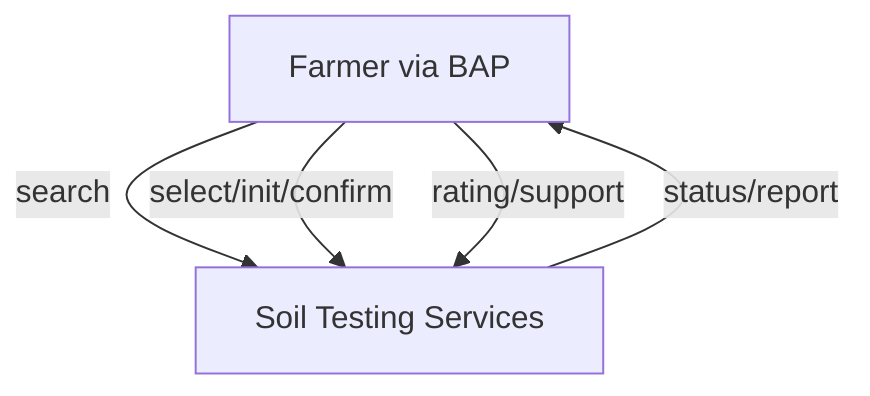
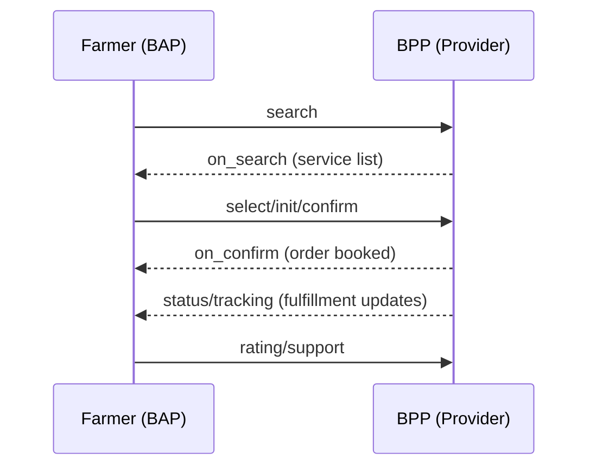

# UKI Soil Testing – Beckn Protocol Implementation Guide

---

## Introduction

This document provides material to help network participants build and integrate their applications with the Unified Krishi Interface (UKI) open network using the Beckn Protocol for soil testing services. Soil testing is fundamental to modern agriculture in India, empowering farmers to make data-driven decisions that significantly increase crop yields, optimize fertilizer usage, reduce costs, and promote sustainable farming practices.

This implementation guide focuses on the soil testing use case where farmers discover and book soil testing services from certified laboratories, with options for sample collection, testing, and advisory recommendations through the UKI network.

### Benefits of Beckn Protocol for Soil Testing Services

- **Decentralized Architecture**: Enables multiple soil testing providers to join the network independently
- **Interoperability**: Allows farmers to access all testing services through any compatible app
- **Standardized Communication**: Creates consistent ways to define and deliver services
- **Data Sovereignty**: Farmers maintain control over their farm data

### Target Audience

- **BAP Developers**: Teams building farmer-facing applications 
- **BPP Developers**: Teams building provider platforms for soil testing services
- **System Integrators**: Organizations connecting existing soil testing services to the UKI network

---

## BAP-BPP Roles and Entity Mapping

### Network Participants

#### Entities Involved:
1. **Farmer** - Service seeker who needs soil testing services
2. **Soil Testing Laboratory** - Certified lab providing soil analysis services
3. **Collection Agent** - Field agent collecting soil samples from farm locations
4. **Agricultural Advisory Service** - Experts providing recommendations based on test results
5. **Aggregator Platform** - Technology platform aggregating multiple soil testing services

#### BAP-BPP Role Mapping:

**BAP (Beckn Application Platform) - Farmer Side:**
- **Farmer Mobile App/Portal**: Interface used by farmers to discover and book soil testing services
- **Agricultural Advisory Platform**: Apps helping farmers with farm management that integrate soil testing
- **Government Extension Services**: Digital platforms used by agricultural extension officers

**BPP (Beckn Provider Platform) - Service Provider Side:**
- **Soil Testing Laboratory Platform**: Digital system of certified soil testing labs
- **Agricultural Service Aggregator**: Platform aggregating multiple testing services
- **Integrated Farm Service Provider**: Companies providing end-to-end agricultural services

### Network Architecture



---

## Soil Testing Journey (DOFP)

### Discovery Phase

- Farmer needs soil testing and searches for services through a BAP
- BAP sends `search` request with:
  - Farmer's location
  - Required test parameters (NPK, pH, micronutrients)
  - Collection preference (farm pickup or lab drop-off)
- BPPs respond with available services including:
  - Test packages with descriptions and parameters
  - Pricing (including any subsidies)
  - Collection options and availability
  - Laboratory credentials and ratings

### Order Phase

- Farmer selects a testing service based on needs and preferences
- Through a three-step process, the order is created:
  1. `select`: Farmer indicates test package and collection preferences
  2. `init`: Farmer provides personal and farm details, scheduling preferences
  3. `confirm`: Final confirmation after reviewing all details and pricing

### Fulfillment Phase

- For farm pickup:
  - Collection agent is assigned and visits farm on scheduled date
  - Samples are collected following standard protocols
  - Agent provides receipt/acknowledgment
  - Samples transported to laboratory

- For center drop-off:
  - Farmer receives instructions for proper sample collection
  - Farmer delivers samples to designated collection center
  - Center provides receipt/acknowledgment

- Laboratory processing:
  - Samples prepared for testing
  - Tests conducted as per standards
  - Results analyzed and quality checked
  - Report generated with results and recommendations

- Throughout fulfillment, status updates are provided via `status` API calls

### Post-Fulfillment Phase

- Farmer receives soil analysis report through the BAP containing:
  - Test results with interpretations
  - Fertilizer recommendations
  - Crop suitability suggestions
- Farmer can:
  - Rate the service
  - Request support for clarifications
  - Access advisory services for implementing recommendations



---

## API Sequence & Payloads

### API Call Sequence

```
search → on_search → select → on_select → init → on_init → confirm → on_confirm → status → on_status → support → on_support → rating → on_rating
```

### Sample API Payloads

**Request: `search`**
```json
{
  "context": {
    "domain": "services:uki",
    "action": "search",
    "location": {
      "country": {"name": "India", "code": "IND"},
      "city": {"name": "Wardha", "code": "std:07152"}
    },
    "version": "1.1.0",
    "bap_id": "farmer-app.uki.com",
    "bap_uri": "https://farmer-app.uki.com",
    "transaction_id": "soil-test-001",
    "message_id": "msg-001",
    "timestamp": "2025-06-02T19:07:25Z"
  },
  "message": {
    "intent": {
      "category": {
        "descriptor": {"code": "soil-testing"}
      },
      "item": {
        "descriptor": {"name": "NPK soil analysis"},
        "tags": [
          {
            "descriptor": {"name": "test-parameters"},
            "list": [
              {"descriptor": {"code": "nitrogen"}, "value": "required"},
              {"descriptor": {"code": "phosphorus"}, "value": "required"},
              {"descriptor": {"code": "potassium"}, "value": "required"},
              {"descriptor": {"code": "ph-level"}, "value": "required"}
            ]
          }
        ]
      },
      "fulfillment": {
        "stops": [
          {
            "type": "collection-location",
            "location": {
              "gps": "20.7489, 78.6085",
              "address": "Village Karanja, Wardha District"
            }
          }
        ]
      }
    }
  }
}
```

**Response: `on_search`** (abbreviated)
```json
{
  "context": {
    "domain": "services:uki",
    "action": "on_search",
    "bpp_id": "soil-lab-network.com",
    "bpp_uri": "https://soil-lab-network.com",
    "transaction_id": "soil-test-001",
    "message_id": "msg-001"
  },
  "message": {
    "catalog": {
      "providers": [
        {
          "id": "agrilab-solutions",
          "descriptor": {
            "name": "AgriLab Solutions",
            "short_desc": "NABL certified soil testing laboratory"
          },
          "items": [
            {
              "id": "npk-micro-test",
              "descriptor": {
                "name": "NPK + Micronutrients Analysis"
              },
              "price": {
                "currency": "INR",
                "value": "500"
              }
            }
          ]
        }
      ]
    }
  }
}
```

More detailed API payloads for the complete sequence are available in the implementation resources.

---

## Taxonomy and Layer 2 Configuration

### Soil Testing Categories
- **BASIC_NPK_TEST**: Basic analysis of primary nutrients
- **COMPREHENSIVE_TEST**: Complete soil fertility assessment
- **PH_TEST**: Soil acidity/alkalinity analysis
- **MICRONUTRIENT_TEST**: Analysis of secondary nutrients

### Fulfillment Types
- **HOME_COLLECTION**: Provider collects samples from farm
- **DROP_OFF**: Farmer brings samples to testing center
- **MOBILE_LAB**: On-site testing with portable equipment
- **DIGITAL_REPORT**: Electronic delivery of test results

### Fulfillment States
- **SAMPLE_COLLECTED**: Soil samples obtained
- **IN_TESTING**: Laboratory analysis in progress
- **RESULTS_READY**: Analysis complete, report available
- **COMPLETED**: Report delivered to farmer
- **CANCELLED**: Service cancelled

### Payment Methods
- **COD**: Cash on delivery
- **UPI**: Digital payments via UPI
- **CARD**: Credit/debit card payments
- **SUBSIDY_VOUCHER**: Government-issued subsidies

---

## Implementation Challenges & Assumptions

### Technical Assumptions
- Network participants implement Beckn Protocol v1.1.0+
- Reliable internet connectivity for API communications
- GPS accuracy sufficient for farm location identification
- Proper data security measures implemented by all parties

### Operational Challenges
- **Connectivity Issues**: Intermittent internet in rural areas
- **Digital Literacy**: Varying technology comfort levels among farmers
- **Last-Mile Logistics**: Efficient sample collection from remote farms
- **Standardization**: Consistent testing methodologies across providers
- **Language Support**: Multiple regional languages for farmer interfaces
- **Payment Integration**: Various payment methods including subsidies
- **Sample Integrity**: Proper collection and transport procedures

### Regulatory Considerations
- Compliance with agricultural testing standards
- Data privacy regulations for farmer information
- Integration with government subsidy schemes
- Recognition of digital soil health reports by authorities

---

## Developer Notes

### Protocol Implementation Guidelines
- Implement proper error handling with standardized codes
- Follow ISO 8601 format for all timestamps
- Sign and validate payloads using Beckn signing policies
- Implement retry mechanisms for network resilience
- Cache appropriate responses to minimize network load

### Security Best Practices
- Use TLS 1.3 for all API communications
- Implement proper authentication for all endpoints
- Store sensitive farmer data with appropriate encryption
- Follow OWASP security guidelines for APIs
- Implement comprehensive logging for security monitoring

### Sandbox Details
- **Domain name**: `services:uki`
- Sandbox environments available for testing implementations
- Test credentials provided upon registration

---

## Resources

- Beckn Protocol Specification: [GitHub Repository](https://github.com/beckn/protocol-specifications)
- UKI Network Documentation: [UKI Portal](https://example-uki-portal.org)
- API Schema Repository: [UKI Schemas](https://github.com/example/uki-schemas)
- Sample Implementations: [UKI Reference](https://github.com/example/uki-reference)