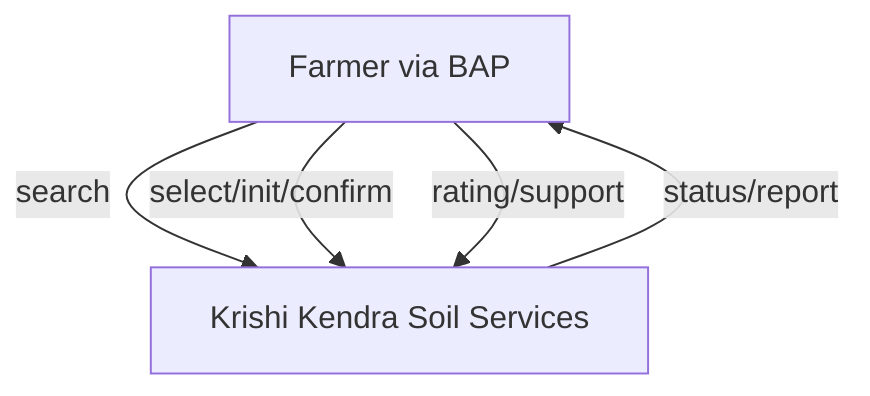
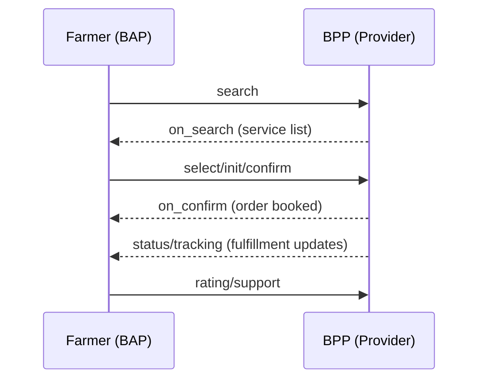
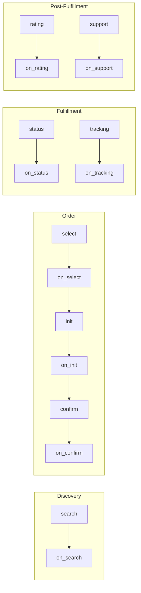

# Krishi Soil Testing – Beckn Protocol Agri Use Case Implementation Guide

---

## Overview

This comprehensive guide outlines how to integrate agricultural service platforms with the Unified Krishi Interface (UKI) open network using the Beckn Protocol. 

Soil testing is fundamental to modern agriculture in India. It empowers farmers to make data-driven decisions that significantly increase crop yields, optimize fertilizer usage, reduce unnecessary costs, and promote environmentally sustainable farming practices. Without proper soil analysis, farmers are essentially farming blindfolded - unable to address specific nutrient deficiencies or soil health issues that directly impact their livelihood.

---

## Table of Contents

- [1. Introduction](#1-introduction)
- [2. Key Entities & Roles](#2-key-entities--roles)
- [3. Network Roles: BAP & BPP](#3-network-roles-bap--bpp)
- [4. Soil Testing Journey (DOFP)](#4-soil-testing-journey-dofp)
- [5. API Sequence & Payloads](#5-api-sequence--payloads)
- [6. Workflows](#6-workflows)
- [7. Taxonomy & Tags](#7-taxonomy--tags)
- [8. Assumptions & Challenges](#8-assumptions--challenges)
- [9. Developer Notes](#9-developer-notes)
- [10. Implementation Roadmap](#10-implementation-roadmap)
- [11. Compliance Requirements](#11-compliance-requirements)
- [12. Frequently Asked Questions](#12-frequently-asked-questions)

---

## 1. Introduction

This guide serves developers who want to build or integrate applications into the UKI Agri network specifically for soil testing services. The Beckn protocol creates a standardized way for different agricultural platforms to communicate with each other, making services more accessible to farmers across India.

### Benefits of Beckn Protocol for Agricultural Services

- **Decentralized Architecture**: Allows many different soil testing providers to join the network without any single company controlling everything - from small local labs to large government facilities
- **Interoperability**: Farmers can use any compatible app to access all testing services in the network, eliminating the need to download multiple apps
- **Scalability**: The network can grow to include thousands of providers and new types of services without requiring major system changes
- **Discoverability**: Makes it easy for farmers to find specialized local testing services that they might never have known existed otherwise
- **Standardization**: Creates consistent ways to define and deliver services while still allowing providers to offer their unique specialties
- **Data Sovereignty**: Farmers remain in control of their own farm data, deciding who can access it and how it can be used

### Target Audience

- **App Developers**: Teams building mobile or web applications that farmers will use to request soil testing
- **Soil Testing Providers**: Government labs, private companies, and universities looking to make their services digitally accessible
- **Agricultural Extension Services**: Organizations that help educate and support farmers with technical advice
- **Agri-input Companies**: Fertilizer, seed, and other agricultural input providers who want to offer value-added soil analysis to improve their services

---

## 2. Key Entities & Roles

|Entity|Description|Role|
|---|---|---|
|**Farmer**|The end user who needs soil testing. This includes everyone from smallholder farmers with less than 1 hectare to large commercial operations. Their digital literacy varies greatly - some may need assistance using apps while others are tech-savvy.|BAP User|
|**Aggregator**|Organizations that bring together multiple service providers on a single platform. Examples include farmer cooperatives (FPOs), agricultural startups, and government extension service apps.|BAP/BPP|
|**Service Provider**|The actual soil testing facilities including government-run Krishi Vigyan Kendras, private laboratories, agricultural universities, and mobile testing units that travel to remote areas.|BPP|
|**Extension Agent**|Field workers who bridge the gap between farmers and technology. They may help collect soil samples, assist farmers with using digital platforms, and explain test results. They're crucial for reaching farmers with limited digital access.|Optional|
|**Logistics Partner**|Services that transport soil samples from farms to testing laboratories. This could be a dedicated courier service or integrated with the testing provider's operations.|Fulfillment Partner|
|**Advisory Service**|Expert services that analyze soil test results and provide specific recommendations on what fertilizers to use, when to apply them, and which crops are best suited for the soil conditions.|Value-Added Service|

---

## 3. Network Roles: BAP & BPP

### Beckn Application Platform (BAP)

- **User Interface Management**: Creates farmer-friendly screens in local languages with simple navigation, visual aids, and voice support for those who cannot read
- **Service Discovery**: Finds and displays suitable soil testing services near the farmer based on their specific needs, location, and the crops they grow
- **Order Management**: Helps farmers select services, schedule sample collection, and handle payments with multiple options (cash, digital, subsidies)
- **Fulfillment Tracking**: Provides clear updates on when samples will be collected, testing progress, and when results will be available
- **Feedback & Support**: Allows farmers to rate services and get help if something goes wrong
- **Data Management**: Safely stores information about farms, previous test results, and farmer preferences while ensuring privacy
- **Recommendation Engine**: Suggests the most appropriate tests based on what crops the farmer grows, seasonal factors, and regional soil issues

### Beckn Provider Platform (BPP)

- **Service Catalog Management**: Maintains a comprehensive, up-to-date list of all available soil tests with clear descriptions, benefits, and pricing
- **Availability Management**: Shows when testing services are available in different areas with real-time scheduling
- **Logistics Coordination**: Plans efficient routes for field agents to collect samples from multiple farms in a single trip
- **Testing Operations**: Manages the entire laboratory workflow from sample preparation to analysis using standardized methods
- **Report Generation**: Creates easy-to-understand soil analysis reports with visual elements to help farmers interpret complex data
- **Agent Allocation**: Assigns the right field staff based on location, language needs, and technical expertise
- **Inventory Management**: Tracks and maintains adequate supplies of testing materials, sample containers, and chemicals
- **Compliance Handling**: Ensures all testing follows government standards and scientific protocols for accurate results

**Mermaid Diagram: BAP ↔ BPP Communication**



---

## 4. Soil Testing Journey (DOFP)

### 4.1. Discovery

- When a farmer needs soil testing, their app (BAP) sends a `search` request to find available services
- The search includes important details like:
  - The farmer's exact location
  - What kind of soil tests they need
  - How they want samples collected (pickup from farm or drop-off at a center)
- Testing providers (BPPs) respond with complete information:
  - Different testing packages (from basic NPK tests to comprehensive analysis)
  - Clear pricing (including any government subsidies or special rates)
  - Collection options (whether they'll come to the farm or the farmer needs to bring samples)
  - Available dates and times for sample collection
  - How long it will take to get results (turnaround time)
  - Additional services like personalized recommendations
  - Credentials showing they're qualified and certified

### 4.2. Order

- The farmer reviews all available options and chooses a provider based on what matters most to them (price, convenience, reputation, etc.)
- The farmer then provides specific details:
  - Whether they want someone to come collect samples or they'll drop them off
  - Exactly which fields or plots need testing (with locations for multiple areas)
  - When they'd prefer the collection to happen
  - What crops they plan to grow (so recommendations can be tailored)
  - How they want to pay and any subsidy programs they qualify for
- The app follows a three-step process to confirm the order:
  - `select`: Checks final availability and confirms exact pricing
  - `init`: Begins the booking process and sets up payment
  - `confirm`: Finalizes the order after the farmer reviews and approves everything

### 4.3. Fulfillment

- **When the Provider Collects Samples from the Farm**:
  - The testing lab assigns a qualified technician to visit the farm
  - The technician receives detailed information about the farm location and specific needs
  - Upon arrival, the technician shows ID to confirm they're official
  - Samples are collected following scientific protocols (proper depth, multiple samples mixed, GPS-tagged locations)
  - The farmer receives a detailed receipt and way to track their samples
  - Samples are carefully transported to the lab with proper handling

- **When the Farmer Brings Samples to a Collection Center**:
  - The farmer receives clear instructions and proper containers for collecting samples
  - Step-by-step guidance helps them take samples correctly
  - The farmer brings samples to the nearest collection center
  - Staff verify the samples and provide a tracking receipt

- **Inside the Testing Laboratory**:
  - Samples go through preparation (drying, grinding, sieving) to ensure accurate testing
  - Lab technicians conduct the requested tests using standardized scientific methods
  - Quality checks verify the accuracy of results
  - Experts review the results to confirm they make sense
  - A comprehensive report is created with all test values and what they mean

- Throughout this process, the farmer receives updates through their app about where their samples are and what's happening

### 4.4. Post-Fulfillment

- Once testing is complete, the farmer receives a comprehensive report through their app that includes:
  - Clear presentation of all test results with normal ranges clearly marked
  - Visual charts and graphs making it easy to understand soil health
  - Specific recommendations for fertilizers and soil treatments
  - Suggestions for which crops would grow best in their soil
  - Comparison with previous tests if available to show trends
- Farmers can ask questions if anything in the report is unclear
- They can rate the service quality to help other farmers
- If there are problems, they can file a formal complaint
- They may be offered additional services like fertilizer delivery or follow-up testing

**Mermaid Diagram: DOFP Flow**



---

## 5. API Sequence & Payloads

### 5.1. API Call Sequence

```
search → on_search → select → on_select → init → on_init → confirm → on_confirm → status → on_status → tracking → on_tracking → update → on_update → support → on_support
```

### 5.2. Detailed API Flow with Business Logic

1. **Search Phase**:
   - The farmer's app builds a detailed search request with everything needed to find appropriate testing services
   - Testing providers filter their available services based on whether they:
     - Can serve the farmer's location
     - Offer the specific tests needed
     - Have capacity available during the requested timeframe
   - Responses include trust-building information like certifications, ratings, and photos of facilities

2. **Selection Phase**:
   - The farmer's app sends their specific selection with any special needs (like evening collection times)
   - The provider checks if they can fulfill these exact requirements
   - The provider calculates the final price including any government subsidies, quantity discounts, or special programs
   - All terms and conditions are clearly presented before proceeding

3. **Initialization Phase**:
   - The farmer's app sends complete order details including how the farmer wants to pay
   - The provider temporarily reserves the requested appointment slot
   - If prepayment is needed, payment processing is set up
   - A digital quote is generated with all services itemized

4. **Confirmation Phase**:
   - The farmer reviews and approves the final order
   - The provider firmly allocates resources for the service (staff, equipment, lab capacity)
   - A digital agreement is created between the farmer and provider
   - Confirmation notifications are sent to all parties

5. **Fulfillment Tracking**:
   - The system provides regular updates at each important stage
   - For farm visits, real-time location tracking shows when the technician will arrive
   - During laboratory testing, updates show exactly what stage the samples are in
   - Any delays trigger immediate notifications with new estimated completion times

6. **Completion and Feedback**:
   - Test results are delivered securely with verification to ensure privacy
   - The farmer can provide structured feedback on multiple aspects of the service
   - Any issues can be formally submitted through the support system
   - Resolution tracking ensures problems are addressed promptly

### 5.3. Sample API Snippets

**Request: `POST /search`**

```json
{
  "context": {
    "domain": "beckn.org/agri-soil_testing",
    "action": "search",
    "bap_id": "farmer-app.uki",
    "transaction_id": "txn-12345",
    "country": "IND",
    "city": "std:080",
    "language": "hi",
    "timestamp": "2023-09-15T08:30:45Z"
  },
  "message": {
    "intent": {
      "service": "soil_testing",
      "location": { 
        "gps": "19.9975,73.7898",
        "radius": {
          "value": 30,
          "unit": "km"
        },
        "address": {
          "name": "Shivaji Farm",
          "locality": "Nashik District",
          "state": "Maharashtra"
        }
      },
      "filters": {
        "required_tests": ["npk", "ph", "oc", "micronutrients"],
        "collection_type": "farm_pickup",
        "preferred_dates": {
          "start": "2023-09-20",
          "end": "2023-09-25"
        },
        "crop_intent": ["wheat", "soybean"],
        "farm_size": {
          "value": 5,
          "unit": "acre"
        },
        "price_range": {
          "min": 0,
          "max": 1000
        }
      }
    }
  }
}
```

**Response: `on_search`**

```json
{
  "context": {
    "domain": "beckn.org/agri-soil_testing",
    "action": "on_search",
    "bpp_id": "krishi-kendra-nashik.uki",
    "bap_id": "farmer-app.uki",
    "transaction_id": "txn-12345",
    "country": "IND",
    "city": "std:080",
    "language": "hi",
    "timestamp": "2023-09-15T08:31:15Z"
  },
  "message": {
    "catalog": {
      "providers": [
        {
          "id": "krishi-kendra-1",
          "name": "Maharashtra State Soil Testing Lab",
          "description": "Government certified soil testing laboratory with comprehensive analysis capabilities",
          ...
        }
      ]
    }
  }
}
```

---

## 6. Workflows

### 6.1 DOFP Layered Flow

**Mermaid Diagram: Layered View**


